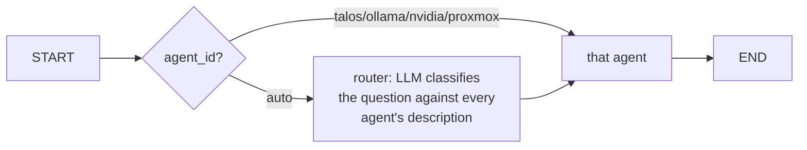

# Agents format

An **agent** is a LangGraph [ReAct agent](https://langchain-ai.github.io/langgraph/reference/prebuilt/#langgraph.prebuilt.chat_agent_executor.create_react_agent)
scoped to one domain — Talos, Ollama, NVIDIA, or Proxmox — built from a
single Markdown file under
[backend/agents/catalog/](backend/agents/catalog/). Like skills
([SKILLS.md](SKILLS.md)), an agent is data plus a prompt, not a bespoke
Python class: `backend/agents/loader.py` reads the file and calls
`create_react_agent(llm, tools, prompt=...)`.

## File shape

```markdown
---
name: talos                         # unique id, kebab-case; used in the GUI's agent selector and API
title: Talos Kubernetes Cluster
description: >
  Diagnoses the Talos-managed Kubernetes cluster: node health, service
  status, pod scheduling/crash issues, cluster events. Use for anything
  about the cluster control plane, nodes, or workloads in general (but not
  GPU driver internals or the Proxmox host itself).
---

You are a troubleshooting assistant for a Talos Linux Kubernetes cluster...

<the rest of the file is the agent's system prompt, verbatim>
```

## Fields

| Field | Required | Meaning |
| --- | --- | --- |
| `name` | yes | Unique id. This is the `agent_id` the API and GUI use to address the agent directly, and the id skills reference in their own `agents:` list. |
| `title` | yes | Display name shown in the GUI's agent picker. |
| `description` | yes | Two jobs: shown under the title in the GUI, **and** fed to the router's classification prompt in `graph.py` when the caller asks for `"auto"` routing instead of naming an agent. Write it as "what this agent is for and isn't for" — the router only has this sentence to go on. |

The **body** (everything after the frontmatter) is used verbatim as the
agent's system prompt. Write it the way you'd brief a human on-call
engineer: what it's responsible for, what tools it has and when to reach for
each, what a good final answer looks like (root cause + evidence + next
step, not just a tool-output dump), and any local topology worth baking in
(node IPs, namespaces) that saves the agent a discovery tool-call every
time.

## Which tools an agent gets

Not declared here — an agent's tool list is derived, not enumerated. At
startup, `backend/agents/loader.py` asks the skills loader for every skill
whose frontmatter `agents:` list contains this agent's `name` (or `"*"`).
That's the same one-directional wiring skills use to declare themselves; see
[SKILLS.md](SKILLS.md#adding-a-skill). Practically: to give the Talos agent a
new capability, add a skill file with `agents: [talos]` — nothing in
`agents/catalog/talos.md` has to change.

## The graph

`backend/graph.py` composes the four compiled agents into one LangGraph
`StateGraph`:



Calling the API with an explicit `agent_id` (what the GUI's dropdown sends
by default) skips the router entirely and goes straight to that agent —
that's the reliable, zero-extra-LLM-call path. `agent_id: "auto"` adds one
classification call so the caller doesn't have to know which domain a
question belongs to.

Each agent runs with its own LangGraph checkpointer thread
(`thread_id` from the API request), so a conversation keeps its tool-call
history and can be asked natural follow-ups without repeating context.

## Adding an agent

1. Copy the closest file in `backend/agents/catalog/` for the frontmatter
   shape and prompt style.
2. Pick a new `name`, write `title`/`description`, write the system prompt.
3. Add skill files tagged with the new agent's name (or reuse existing ones
   via `agents: [existing, new-name]`).
4. Add the id to `graph.py`'s router's list of valid destinations (one line)
   and to the frontend's agent list if it isn't fetched dynamically from
   `/api/agents` (it is, by default — see `frontend/src/api.js`).

## Shipped agents

| id | Title | Scope |
| --- | --- | --- |
| `talos` | Talos Kubernetes Cluster | Node health, `talosctl`/`kubectl` state, pod scheduling and crash issues, cluster events |
| `ollama` | Ollama Server | The `ollama` Helm release: pod health, loaded/pulled models, GPU scheduling of the ollama pod, its own HTTP API |
| `nvidia` | NVIDIA GPU | Driver/device state on the GPU-carrying Talos node: `nvidia-smi`, device-plugin health, PCI/dmesg evidence of Xid errors or driver load failures |
| `proxmox` | Proxmox Host | The hypervisor itself, over SSH: `pve*` services, VM/CT inventory, host disk/journal/dmesg |

See [backend/agents/catalog/](backend/agents/catalog/) for the full prompts,
and [README.md](README.md) for how to run all of this.
