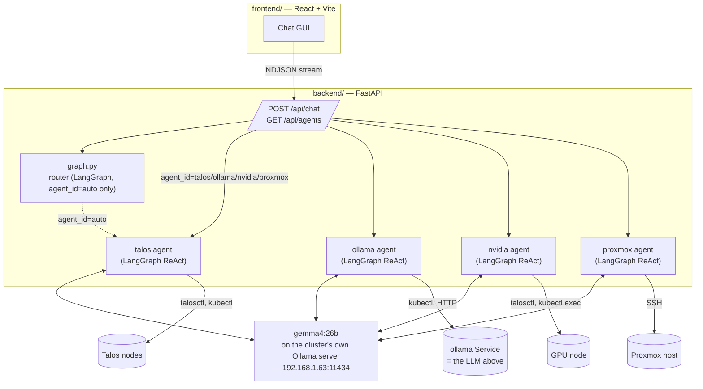

# Troubleshooting Agents

Four LangGraph troubleshooting agents — **Talos**, **Ollama**, **NVIDIA
GPU**, **Proxmox Host** — for this repo's own cluster, backed by a single
shared LLM (`gemma4:26b`, served by the cluster's own Ollama deployment),
with a small React GUI to query them.

This directory is fully independent of the Terraform above it: nothing here
runs `terraform`, and nothing in `../` depends on this. It reads the
cluster's state (`kubectl`, `talosctl`, SSH, HTTP) to diagnose, never to
change it — every shipped skill is a read-only command. See
[SKILLS.md](SKILLS.md#safety).

## Why it's shaped this way

Both **what an agent knows** (its system prompt) and **what it can run**
(its tools) are Markdown files with YAML frontmatter, not Python:

- [AGENTS.md](AGENTS.md) — the format for `backend/agents/catalog/*.md`, one
  file per agent, frontmatter for wiring + body as the system prompt.
- [SKILLS.md](SKILLS.md) — the format for `backend/skills/catalog/*.md`, one
  file per diagnostic tool, frontmatter for the command and its parameters.

`backend/agents/loader.py` and `backend/skills/loader.py` are the only code
that ever needs to change, and normally shouldn't: adding a diagnostic or
an agent is adding a file, not writing a function. See each doc's "Adding
a(n) skill/agent" section.

## Architecture



Worth noticing: the **ollama** agent's target and this whole system's LLM
are the same server. A slow or failing response from the model you're
talking to is itself evidence about the system the `ollama` agent
diagnoses — see the note in `backend/agents/catalog/ollama.md`.

## Prerequisites

Whatever machine runs `backend/` needs, already configured and on `PATH`:

- **Python 3.11+**
- `talosctl`, configured (`~/.talos/config`) to reach this cluster — same
  assumption the repo's own `terraform apply` makes
- `kubectl`, or just a valid kubeconfig at `../.kube/config` (the default;
  `terraform apply` in the parent directory writes this)
- `ssh` with a working key-based login to the Proxmox host
- `helm` (only for the `ollama-helm-status` skill)
- Network reachability to the Ollama server (`192.168.1.63:11434` by
  default) and to the four Talos node IPs

For the GUI: **Node 18+** (only to run the Vite dev server / build).

## Running it

```bash
cd backend
python3 -m venv .venv && source .venv/bin/activate
pip install -r requirements.txt
cp ../.env.example ../.env   # then edit anything that doesn't match your setup
python run.py                # http://localhost:8000
```

```bash
cd frontend
npm install
npm run dev                  # http://localhost:5173
```

Open the GUI, pick an agent (or leave it on "Auto-detect"), and ask a
question. `GET /api/health` on the backend is a quick way to confirm it
started and which model/URL it's pointed at.

## A real latency note

Measured against this repo's own server: a trivial one-word reply from
`gemma4:26b` took **~58 seconds** cold (most of it prompt evaluation), and
a full tool-calling turn (one tool call + interpreting its result) took
**~19 seconds** once the model was warm. This is a 25B-parameter model on
a single passed-through GPU — expect answers to take tens of seconds to a
few minutes, especially the first request after the model's been idle.
Two knobs in `backend/config.py` exist because of this:

- `OLLAMA_KEEP_ALIVE` (default `30m`) — how long Ollama keeps the model
  loaded between requests, so a multi-turn conversation doesn't pay the
  cold-start cost every turn.
- `OLLAMA_REQUEST_TIMEOUT` (default `300` seconds) — the backend's own
  client timeout; raise it if you see the backend give up before the
  model actually replies.

The GUI streams tool calls/results as they happen precisely so there's
something to look at during this wait, rather than a blank spinner.

## Repository layout

```
troubleshooting-agents/
├── AGENTS.md                   # agent file format + shipped agent list
├── SKILLS.md                   # skill file format + shipped skill catalog
├── .env.example
├── backend/
│   ├── config.py                # all environment-derived settings
│   ├── llm.py                   # the shared ChatOllama instance
│   ├── md_frontmatter.py        # shared frontmatter/body parser
│   ├── graph.py                 # agent_id resolution (direct, or LangGraph router)
│   ├── server.py                 # FastAPI app: /api/agents, /api/chat (NDJSON stream)
│   ├── run.py                    # entrypoint
│   ├── requirements.txt
│   ├── agents/
│   │   ├── loader.py             # *.md -> create_react_agent
│   │   └── catalog/*.md          # one file per agent (see AGENTS.md)
│   └── skills/
│       ├── executor.py           # actually runs a command (local/ssh/kubectl/http)
│       ├── loader.py             # *.md -> LangChain StructuredTool
│       └── catalog/*.md          # one file per diagnostic (see SKILLS.md)
└── frontend/
    ├── src/
    │   ├── App.jsx                # chat state machine + layout
    │   ├── api.js                 # fetch/streaming client for the backend
    │   └── components/            # AgentSelector, MessageBubble, TraceView
    └── ...vite scaffolding
```

## Extending this

- **New diagnostic for an existing agent**: add a file to
  `backend/skills/catalog/`. See [SKILLS.md](SKILLS.md#adding-a-skill).
- **New agent (a new domain entirely)**: add a file to
  `backend/agents/catalog/`, add skills tagged with its name, add its id to
  nothing else — `/api/agents` and the GUI's dropdown both read the catalog
  live. See [AGENTS.md](AGENTS.md#adding-an-agent).
- **A mutating action** (restart a pod, reboot a node): possible via the
  `safe: false` + `confirm` mechanism in [SKILLS.md](SKILLS.md#safety), but
  deliberately not shipped here — treat adding one as a real design
  decision (what confirms it, who can trigger it, what it logs), not a
  one-line config change.
- **Streaming token-by-token** instead of per-tool-step: `server.py`'s
  `_stream_chat` currently uses LangGraph's `stream_mode="updates"` (one
  event per finished node); switching to `stream_mode="messages"` would
  give token-level streaming of the final answer at the cost of a slightly
  busier event stream for the GUI to parse.
- **A different backing model**: `OLLAMA_MODEL`/`OLLAMA_BASE_URL` in `.env`
  — nothing else references either.

## Troubleshooting the troubleshooter

- **`GET /api/health` fails to reach the model** — confirm
  `OLLAMA_BASE_URL` is reachable from the backend's own host (`curl
  $OLLAMA_BASE_URL/api/version`) and that `OLLAMA_MODEL` matches an entry
  in `ollama list` on that server exactly (tag included).
- **A `local`/`ssh` skill fails with "not installed / not on PATH"** — that
  binary needs to be on the backend process's `PATH`, not just available
  somewhere on the machine (a login shell's `PATH` doesn't always match a
  service/venv's).
- **A `kubectl`-target skill can't find a pod** — its `selector` is a
  best-effort guess at the chart's labels; run `k8s-get-pods` in that
  namespace to confirm the real labels and adjust the skill file (see
  `nvidia-smi.md`, `nvidia-device-plugin-logs.md`).
- **`proxmox-*` skills fail to authenticate** — these use plain `ssh` with
  `BatchMode=yes` (no password prompts), so the backend's host needs a key
  already trusted by the Proxmox host; set `PROXMOX_SSH_KEY` if it isn't
  the default identity.
